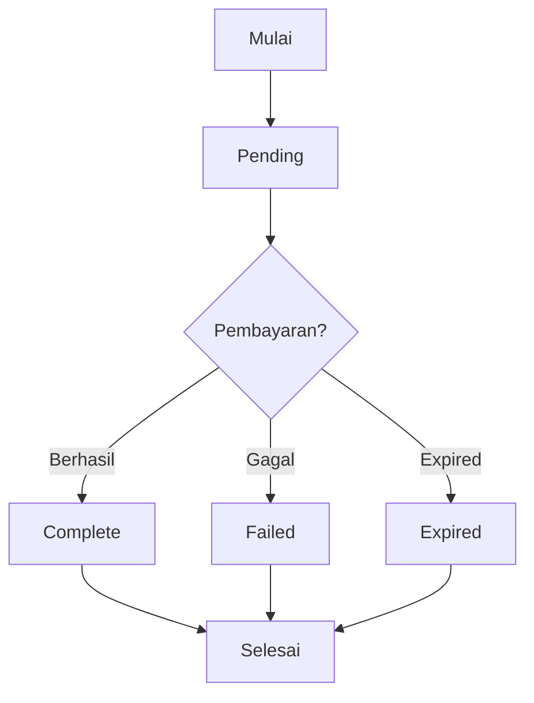

# Flow Aplikasi AZ Store

## 1. Flow Transaksi

### A. Pembuatan Transaksi

1. User memilih layanan (e-wallet, pulsa, token listrik, dll)
2. User mengisi detail transaksi:
    - Untuk e-wallet: kode e-wallet & nomor telepon
    - Untuk pulsa: nomor telepon & nominal
    - Untuk token listrik: nomor meter & nominal
    - Untuk tiket bus: detail penumpang & jadwal
3. Sistem menghitung admin fee berdasarkan metode pembayaran
4. Sistem membuat transaksi dengan status `pending`
5. Sistem generate snap token dari Midtrans
6. User diarahkan ke halaman pembayaran Midtrans

### B. Proses Pembayaran

1. User memilih metode pembayaran di halaman Midtrans
2. Untuk setiap metode pembayaran:
    - QRIS: User scan QR code
    - Bank Transfer: User transfer ke rekening virtual
    - E-wallet: User melakukan pembayaran via e-wallet
3. Midtrans mengirim notifikasi ke endpoint webhook
4. Sistem memverifikasi signature dari Midtrans
5. Sistem update status transaksi:
    - Payment Status → `paid`
    - Transaction Status → `complete`

### C. Status Transaksi



## 2. Flow Notifikasi Pembayaran

### A. Webhook dari Midtrans

1. Midtrans mengirim POST request ke `/api/transactions/notification`
2. Sistem memverifikasi:
    - Keberadaan order ID
    - Signature dari Midtrans
    - Status pembayaran
3. Sistem update status transaksi
4. Sistem mencatat log untuk audit trail

### B. Format Notifikasi

```json
{
    "transaction_time": "2025-08-11 11:19:44",
    "transaction_status": "settlement",
    "transaction_id": "d9390d82-8f5e-4231-9de6-a303eff67ac6",
    "status_message": "midtrans payment notification",
    "status_code": "200",
    "signature_key": "...",
    "payment_type": "bank_transfer",
    "order_id": "TRX-XXXXXXXX",
    "merchant_id": "XXXXXXXX",
    "gross_amount": "154000.00",
    "fraud_status": "accept",
    "currency": "IDR"
}
```

## 3. Flow Authentication

### A. Register

1. User mengisi form registrasi (nama, email, password)
2. Sistem validasi input
3. Sistem hash password
4. Sistem create user baru
5. Sistem generate token

### B. Login

1. User input email & password
2. Sistem validasi credentials
3. Sistem generate token baru
4. Return token ke user

### C. Middleware Authentication

1. Cek keberadaan token
2. Validasi token
3. Attach user ke request
4. Route protection berdasarkan role

## 4. Flow Admin

### A. Dashboard

1. Admin login dengan role admin
2. Sistem tampilkan statistik:
    - Total transaksi
    - Total pendapatan
    - Transaksi per status
    - User aktif

### B. Manajemen Transaksi

1. View semua transaksi
2. Filter berdasarkan:
    - Status
    - Tipe transaksi
    - Tanggal
3. Export data transaksi
4. View detail transaksi

### C. Manajemen User

1. View semua users
2. Filter berdasarkan role
3. Aktivasi/deaktivasi user
4. Reset password user

## 5. Error Handling

### A. Validasi Input

1. Validasi format input
2. Validasi business rules
3. Return error details

### B. Pembayaran

1. Handle timeout
2. Handle invalid signature
3. Handle duplicate notifications
4. Log semua errors

### C. Rate Limiting

1. Batasi request per minute
2. Handle too many requests
3. Return 429 status code

## 6. Logging & Monitoring

### A. Transaction Logs

1. Log creation
2. Log status updates
3. Log payment notifications
4. Log errors

### B. Authentication Logs

1. Log login attempts
2. Log failed logins
3. Log password resets

### C. Error Logs

1. Log validation errors
2. Log payment errors
3. Log system errors
